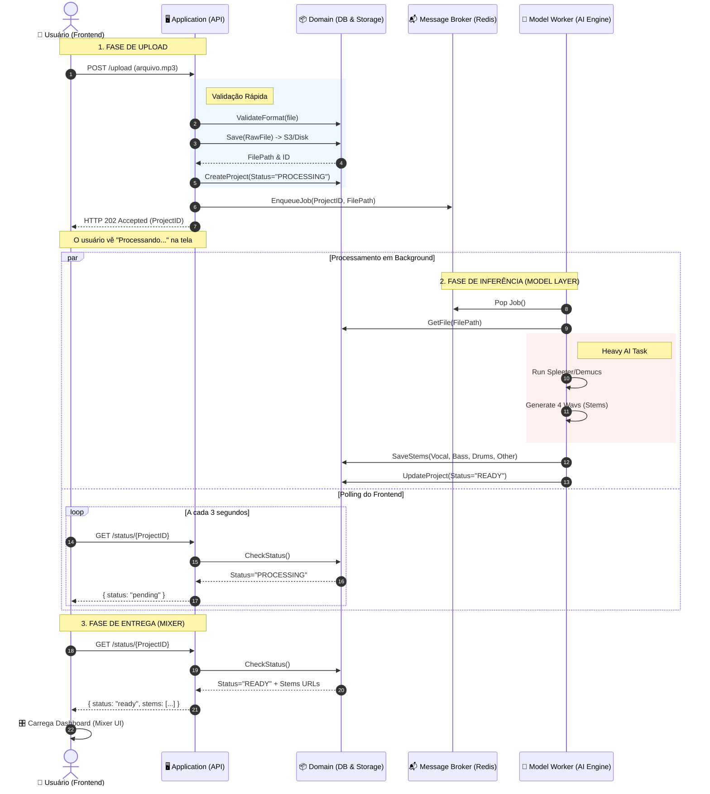
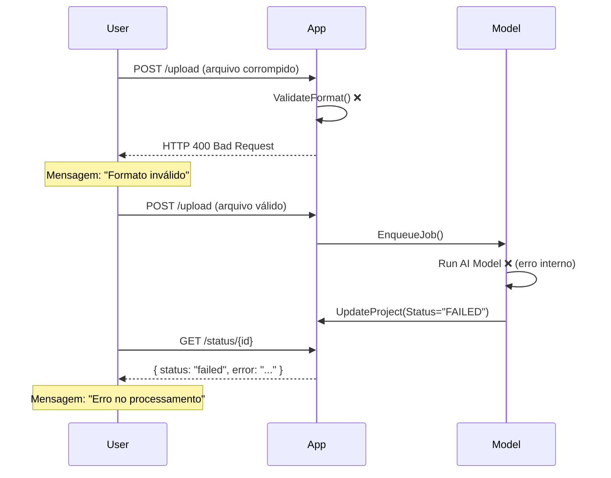

# Diagrama de Sequência - IsoMix Studio
## Fluxo de Upload e Processamento Assíncrono

---

## Visão Geral

Este diagrama ilustra o fluxo completo desde o upload de um arquivo de áudio até a disponibilização do mixer interativo para o usuário. O processamento é **assíncrono** para garantir que a interface não trave durante a execução do modelo de IA.

---

## Diagrama Mermaid



---

## Explicação Detalhada por Fase

### 🔵 Fase 1: Upload (Application Layer)

#### Passos 1-7
1. **Usuário envia arquivo**: O frontend faz um `POST /upload` com o arquivo de áudio
2. **Validação rápida**: O Application Layer verifica:
   - MIME type real (não apenas extensão)
   - Tamanho do arquivo (limite Free/Pro)
   - Formato suportado (MP3, WAV, FLAC)
3. **Salvamento no Storage**: O Domain Layer persiste o arquivo bruto no S3/MinIO
4. **Criação do Projeto**: Entidade `Project` criada no banco com status `PROCESSING`
5. **Enfileiramento**: Job adicionado à fila Redis com `ProjectID` e `FilePath`
6. **Resposta imediata**: API retorna `HTTP 202 Accepted` com o `ProjectID`

**Tempo total: < 2 segundos**

---

### 🔴 Fase 2: Inferência (Model Layer)

#### Processamento em Background (Passos 8-13)
8. **Worker consome job**: O Model Worker (Celery) pega o próximo job da fila
9. **Carrega arquivo**: Busca o arquivo bruto do storage
10. **Execução do modelo de IA**:
    - Carrega modelo Demucs/Spleeter na memória
    - Processa o áudio (pode levar 30-120 segundos)
    - Gera 4 arquivos WAV separados
11. **Salvamento dos stems**: Cada stem é salvo no storage com nome único
12. **Atualização de status**: `Project.status` muda para `READY`

**Tempo total: 30-120 segundos (dependendo do hardware)**

#### Polling do Frontend (Passos 8-13, paralelo)
- A cada **3 segundos**, o frontend consulta `GET /status/{ProjectID}`
- Enquanto `status == "PROCESSING"`, exibe loader/spinner
- Quando `status == "READY"`, recebe URLs dos stems

---

### 🟢 Fase 3: Entrega (Application Layer)

#### Passos 14-17
14. **Última verificação de status**: Frontend confirma que processamento terminou
15. **Retorno das URLs**: API retorna:
    ```json
    {
      "status": "ready",
      "stems": [
        {"name": "vocal", "url": "https://s3.../vocal.wav"},
        {"name": "drums", "url": "https://s3.../drums.wav"},
        {"name": "bass", "url": "https://s3.../bass.wav"},
        {"name": "other", "url": "https://s3.../other.wav"}
      ]
    }
    ```
16. **Carregamento do Mixer**: Frontend baixa os 4 stems e inicializa a Web Audio API
17. **Usuário interage**: Mixer está pronto para uso

**Tempo total: < 5 segundos**

---

## Componentes e Responsabilidades

### 🖥️ Application Layer (FastAPI)
- **Responsabilidade**: Orquestração e validação
- **NÃO faz**: Processamento pesado de áudio
- **Endpoints**:
  - `POST /upload` → Valida e enfileira
  - `GET /status/{id}` → Consulta status do projeto
  - `POST /export` → Renderiza mix customizado

### 📦 Domain Layer (PostgreSQL + S3)
- **Responsabilidade**: Persistência e regras de negócio
- **Entidades**:
  - `Project` (id, status, user_id, created_at)
  - `Stem` (id, project_id, type, file_path)
- **Validações**:
  - Formato de arquivo
  - Limites de cota (Free/Pro)

### 📬 Message Broker (Redis)
- **Responsabilidade**: Fila de jobs assíncronos
- **Vantagens**:
  - Desacopla API do processamento
  - Permite escalar workers horizontalmente
  - Evita sobrecarga do servidor web

### 🧠 Model Worker (Celery + Demucs)
- **Responsabilidade**: Execução do modelo de IA
- **Isolamento**: Roda em processo separado (pode ser em máquina diferente)
- **Escalabilidade**: Múltiplos workers podem processar jobs em paralelo

---

## Fluxo de Erro



---

## Otimizações Futuras

### 1. WebSockets para Status em Tempo Real
Substituir polling por WebSocket:
```javascript
// Frontend
const ws = new WebSocket(`wss://api.isomix.io/ws/${projectId}`);
ws.onmessage = (event) => {
  const { status, progress } = JSON.parse(event.data);
  if (status === 'ready') loadMixer();
};
```

### 2. Pré-processamento Progressivo
Enviar stems conforme ficam prontos:
- Vocal (pronto em 20s) → Envia
- Drums (pronto em 40s) → Envia
- Bass (pronto em 60s) → Envia
- Other (pronto em 80s) → Envia

### 3. Cache de Modelos
Manter modelo carregado em memória para reduzir latência:
```python
# Worker mantém modelo em RAM
model = load_demucs_model()  # 1x na inicialização
# Cada job reutiliza o modelo
```

---

## Métricas de Performance

| Fase | Tempo Esperado | Timeout |
|------|----------------|---------|
| Upload + Validação | < 2s | 10s |
| Processamento IA | 30-120s | 300s |
| Carregamento Mixer | < 5s | 30s |
| **Total (E2E)** | **40-130s** | **340s** |

---

## Próximos Passos

1. ✅ Implementar endpoint `POST /upload`
2. ✅ Configurar Celery worker
3. ✅ Integrar modelo Demucs
4. ⬜ Implementar polling no frontend
5. ⬜ Criar interface do mixer
6. ⬜ Adicionar tratamento de erros robusto

---

## Referências Técnicas

- [Celery Best Practices](https://docs.celeryproject.org/en/stable/userguide/tasks.html)
- [Demucs GitHub](https://github.com/facebookresearch/demucs)
- [Web Audio API](https://developer.mozilla.org/en-US/docs/Web/API/Web_Audio_API)
- [Wavesurfer.js](https://wavesurfer-js.org/)
